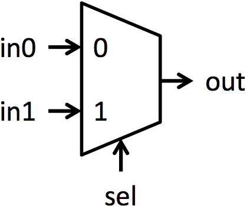
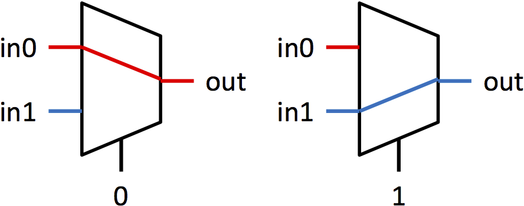
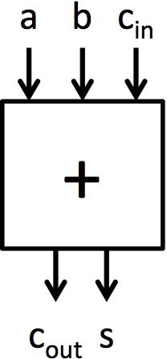
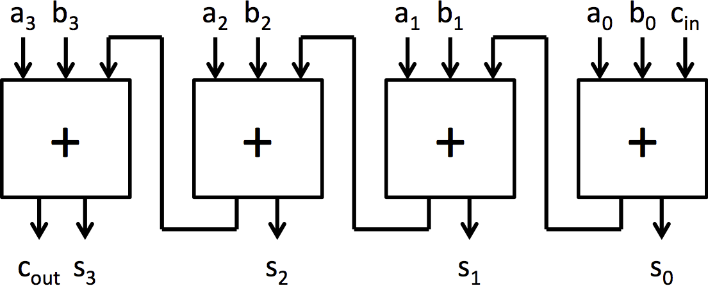
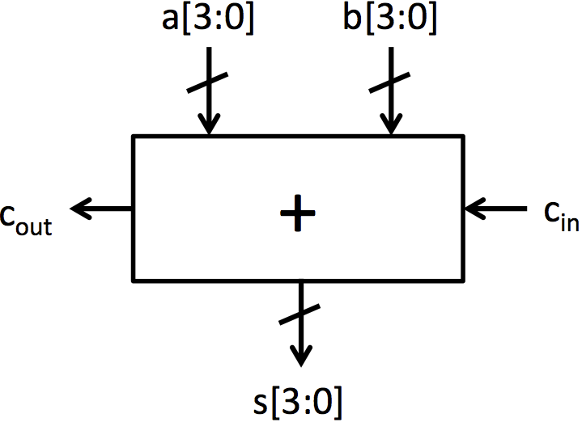

# Lab 1: Multiplexers and Adders 

> **Lab 1 due date:** Friday, September 16, 2016, at 11:59:59 PM EDT.
>
> Your deliverables for Lab 1 are:
>
> - your answers to Exercises 1-5, in `Multiplexer.bsv` and `Adders.bsv`, and
> - your answers to the discussion questions in `discussion.txt`.

## Introduction

In this lab, you will build multiplexers and adders from basic gate primitives. First, you will build a 1-bit multiplexer using and, or, and not gates. Next, you will write a polymorphic multiplexer using for-loops. Then, you will switch to working with adders, constructing a 4-bit adder using full adders. Lastly, you will modify an 8-bit ripple-carry adder to change it to a carry-select adder.

This lab is used as an introduction to simple combinational circuits and Bluespec SystemVerilog (BSV). Even though BSV contains higher-level functions to create circuits, this lab will focus on using low-level gates to create blocks used in higher-level circuits, such as adders. This stresses the hardware generated by the BSV compiler.

### Multiplexers

Multiplexers (or *muxes* for short) are blocks that select between multiple signals. A multiplexer has multiple data inputs `inN`, a select input `sel`, and a single output `out`. The value of `sel` determines which input is shown on the output. The muxes in this lab are all 2-way muxes. That means there will be two inputs to select between (`in0` and `in1`) and `sel` will be a single bit. If `sel` is 0, then `out` = `in0`. If `sel` is 1, then `out` = `in1`. Figure 1a shows the symbol used for a mux, and figure 1b shows pictorially the function of a mux.

|  |  |
| --------------------------------------- | -------------------------------------------------- |
| (a) Multiplexer symbol                  | (b) Multiplexer functionality                      |

Figure 1: Symbol and functionality of 1-bit multiplexer

### Adders

Adders are essential building blocks for digital systems. There are many different adder architectures that all compute the same result, but they get to the results in different ways. Different adder architectures also differ in area, speed, and power, and there is no architecture that dominates all other adders in all the areas. Therefore, hardware designers choose adders based on system area, speed, and power constraints.

The adder architectures we are going to explore are the ripple-carry adder and the carry-select adder. The ripple-carry adder is the simplest adder architecture. It is made up of a chain of full adder blocks connected through the carry chain. A 4-bit ripple-carry adder can be seen in figure 2b. It is very small, but it is also very slow because each full adder has to wait for the previous full adder to finish before it can compute its bit.

The carry-select adder adds prediction or speculation to the ripple-carry adder to speed up execution. It computes the bottom bits the same way the ripple-carry adder computes them, but it differs in the way it computes the top bits. Instead of waiting for the carry signal from the lower bits to be computed, it computes two possible results for the top bits: one results assumes there is no carry from the lower bits and the other assumes there is a bit carried over. Once that carry bit is calculated, a mux selects the top bits that correspond to the carry bit. An 8-bit carry-select adder can be seen in figure 3.

|  |  |
| -------------------------------------- | ------------------------------------------------------------ |
| (a) Full adder                         | (b) 4-bit ripple-carry adder built from full adders          |

|  |  |
| --------------------------------------------------------- | ------------------------------------------------------------ |
| (c) Symbol for 4-bit adder                                | (d) 8-bit ripple-carry adder                                 |

Figure 2: Construction of a 4-bit adder and an 8-bit adder from full adder blocks

|  |
| ------------------------------------------------------------ |

Figure 3: 8-bit carry-select adder 

### Testbenches

The testbenches to test your code have already been written, and links to the testbenches are included in the repository for this lab. The file `TestBench.bsv` contains multiple testbenches that can be individually compiled by using the provided `Makefile`. The `Makefile` has a target for each simulator executable, and the use of each target and executable is explained in this handout. Each executable prints out `PASSED` when the program works, and `FAILED` when the program encounters an error.

The testbenches ending in `Simple` have a simplified structure, and they output all the data that came from the unit during the test so you can see the unit working. If you are interested in testing your own cases for these units, you can modify the simple testbenches to input the values you request. The normal testbench generates random numbers for input values.

## Building multiplexers in BSV

The first step in constructing our carry-select adder is to build a basic multiplexer from gates. Let’s first examine `Multiplexer.bsv`.

```rust
function Bit#(1) multiplexer1(Bit#(1) sel, Bit#(1) a, Bit#(1) b);
    return (sel == 0)? a: b;
endfunction
```

The first line begins a definition of a new function called `multiplexer1`. This multiplexer function takes several arguments which will be used in defining the behavior of the multiplexer. This multiplexer operates on single bit values, the concrete type `Bit#(1)`. Later we will learn how to implement polymorphic functions, which can handle arguments of any width.

This function uses C-like constructs in its definition. Simple code, such as the multiplexer can be defined at the high level without implementation penalty. However, because hardware compilation is a dificult, multi-dimensional problem, tools are limited in the kinds of optimizations that they can do.

The `return` statement, which constitutes the entire function, takes two input and selects between them using `sel`. The `endfunction` keyword completes the definition of our multiplexer function. You should be able to compile the module.

> **Exercise 1 (4 Points):** Using the and, or, and not gates, re-implement the function `multiplexer1` in `Multiplexer.bsv`. How many gates are needed? (The required functions, called `and1`, `or1` and `not1`, respectively, are provided in `Multiplexers.bsv`.)

### Static elaboration

Many muxes in real world systems are larger than 1-bit wide. We will need multiplexers that are larger than a single bit, but writing the code to manually instantiate 32 single-bit multiplexers to form a 32-bit multiplexer would be tedious. Fortunately, BSV provides constructs for powerful static elaboration which we can use to make writing the code easier. Static elaboration refers to the process by which the BSV compiler evaluates expressions at compile time, using the results to generate the hardware. Static elaboration can be used to express extremely flexible designs in only a few lines of code.

In BSV we can use bracket notation (`[]`) to index individual bits in a wider `Bit` type, for example `bitVector[1]` selects the second least significant bit in `bitVector` (`bitVector[0]` selects the least significant bit since BSV's indexing starts at 0). We can use a for-loop to copy many lines of code which have the same form. For example, to aggregate the `and1` function to form a 5-bit `and` function, we could write:

```
function Bit#(5) and5(Bit#(5) a, Bit#(5) b); Bit#(5) aggregate;
    for(Integer i = 0; i < 5; i = i + 1) begin
        aggregate[i] = and1(a[i], b[i]);
    end
    return aggregate;
endfunction
```

The BSV compiler, during its static elaboration phase, will replace this for loop with its fully unrolled version.

```
aggregate[0] = and1(a[0], b[0]);
aggregate[1] = and1(a[1], b[1]);
aggregate[2] = and1(a[2], b[2]);
aggregate[3] = and1(a[3], b[3]);
aggregate[4] = and1(a[4], b[4]);
```

> **Exercise 2 (1 Point):** Complete the implementation of the function > `multiplexer5` in `Multiplexer.bsv` using for loops and `multiplexer1`.
> Check the correctness of the code by running the multiplexer testbench:
>
> ```
> $ make mux
> $ ./simMux
> ```
>
> An alternate test bench can be used to see outputs from the unit by running:
>
> ```
> $ make muxsimple
> $ ./simMuxSimple
> ```

### Polymorphism and higher-order constructors

So far, we have implemented two versions of the multiplexer function, but it is easy to imagine needing an n-bit multiplexer. It would be nice if we did not have to completely re-implement the multiplexer whenever we want to use a different width. Using the for-loops introduced in the previous section, our multiplexer code is already somewhat parametric because we use a constant size and the same type throughout. We can do better by giving a name (`N`) to the size of the multiplexer using `typedef`. Our new multiplexer code looks something like:

```rust
typedef 5 N;
function Bit#(N) multiplexerN(Bit#(1) sel, Bit#(N) a, Bit#(N) b);
    // ...
    // code from multiplexer5 with 5 replaced with N (or valueOf(N))
    // ...
endfunction
```

The typedef gives us the ability to change the size of our multiplexer at will. The `valueOf` function introduces a small subtlety in our code: `N` is not an `Integer` but a *numeric type* and must be converted to an `Integer` before being used in an expression. Even though it is improved, our implementation is still missing some flexibility. All instantiations of the multiplexer must have the same type, and we still have to produce new code each time we want a new multiplexer. However in BSV we can further parameterize the module to allow different instantiations to have instantiation-specific parameters. This sort of module is polymorphic, the implementation of the hardware changes automatically based on compile time configuration. Polymorphism is the essence of design-space exploration in BSV.

The truly polymorphic multiplexer can be started as follows:

```
// typedef 32 N; // Not needed
function Bit#(n) multiplexer n(Bit#(1) sel, Bit#(n) a, Bit#(n) b);
```

The variable `n` represents the width of the multiplexer, replacing the concrete value `N` (=32). In BSV *type variables* (`n`) start with a lower case whereas concrete types (`N`) start with an upper case.

> **Exercise 3 (2 Points):** Complete the definition of the function `multiplexer_n`. Verify that this function is correct by replacing the original definition of `multiplexer5` to only have: `return multiplexer_n(sel, a, b);`. This redefinition allows the test benches to test your new implementation without modification.

## Building adders in BSV

We will now move on to building adders. The fundamental cell for adding is the full adder which is shown in Figure 2a. This cell adds two input bits and a carry in bit, and it produces a sum bit and a carry out bit. `Adders.bsv` contains two function definitions that describe the behavior of the full adder. `fa_add` computes the add output of a full adder, and `fa_carry` computes the carry output. These functions contain the same logic as the full adder presented in lecture 2.

An adder that operates on 4-bit numbers can be made by chaining together 4 full adders as shown in Figure 2b. This adder architecture is known as a ripple-carry adder because of the structure of the carry chain. To generate this adder without writing out each of the explicit full adders, a for loop can be used similar to `multiplexer5`.

> **Exercise 4 (2 Points):** Complete the code for `add4` by using a for loop to properly connect all the uses of `fa_sum` and `fa_carry`.

Larger adders can be constructed by connecting 4-bit adders, just like the 4-bit adder was constructed by connecting full adders. `Adders.bsv` contains two modules for adders constructed using add4 and connecting circuitry: `mkRCAdder` and `mkCSAdder`. Note that, unlike the other adders to this point, these adders are implemented as a module instead of a function. This is a subtle, but important distinction. In BSV, functions are inlined by the compiler automatically, while modules must be explicitly instantiated using the '`<-`' notation. If we made the 8-bit adder a function, using it in multiple locations in BSV code would instantiate multiple adders. By making it a module, multiple sources can use the same 8-bit adder.

The full implementation for the 8-bit ripple-carry adder shown in Figure 2d is included in the module `mkRCAdder`. It can be tested by running the following:

```
$ make rca
$ ./simRca
```

Since `mkRCAdder` is constructed by combining `add4` instances, running `./simRCA` will also test `add4`. An alternate test bench can be used to see outputs from the unit by running:

```
$ make rcasimple
$ ./simRcaSimple
```

There is also a `mkCSAdder` module that is intended to implement the carry-select adder shown in Figure 3, but its implementation is not included.

> **Exercise 5 (5 Points):** Complete the code for the carry-select adder in the module `mkCSAdder`. Use Figure 3 as a guide for the required hardware and connections. This module can be tested by running the following:
>
> ```
> $ make csa
> $ ./simCsa
> ```
>
> An alternate test bench can be used to see outputs from the unit by running:
>
> ```
> $ make csasimple
> $ ./simCsaSimple
> ```

## Discussion Questions

> Write your answers to these questions in the text file `discussion.txt` provided with the initial lab code.
>
> 1. How many gates does your one-bit multiplexer use? The 5-bit multiplexer? Write down a formula for the number of gates in an N-bit multiplexer. **(2 Points)**
> 2. Assume a single full adder requires 5 gates. How many gates does the 8-bit ripple-carry adder require? How many gates does the 8-bit carry-select adder require? **(2 Points)**
> 3. Assume a single full adder requires A time unit to compute its outputs once all its inputs are valid and a mux requires M time unit to compute its output. In terms of A and M, how long does the 8-bit ripple-carry adder take? How long does the 8-bit carry-select adder take? **(2 Points)**
> 4. Optional: How long did you take to work on this lab?

When you're done, add any necessary files to the repository using git add, commit the changes with `git commit -am "Final submission"`, and push the modifications for grading with `git push`.

------

© 2016 [Massachusetts Institute of Technology](http://web.mit.edu/). All rights reserved.
