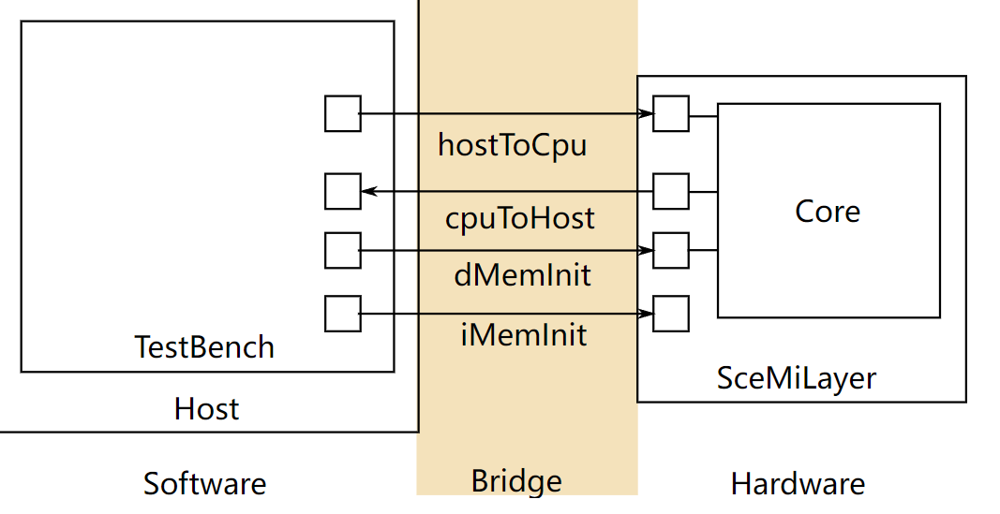

# Lab 5: RISC-V Introduction - Multi-cycle and Two-Stage Pipelines

> **Lab 5 due date:** Monday, October 24, 2016, at 11:59:59 PM EDT.
>
> Your deliverables for Lab 5 are:
>
> - your answers to Exercises 1-4 in `TwoCycle.bsv`, `FourCycle.bsv`, `TwoStage.bsv`, and `TwoStageBTB.bsv`
> - your answers to Discussion Questions 1-4 in `discussion.txt`

## Introduction

This lab introduces the RISC-V processor and the toolflow associated with it. The lab begins with the introduction of a single-cycle implementation of a RISC-V processor. You will then create two- and four-cycle implementations driven by memory structural hazards. You will finish by creating a two-stage pipelined implementation so the fetch and execute stages happen in parallel. This two-stage pipeline will be the basis for future pipelined implementations.

## The processor infrastructure

A large amount of work has already been done for you in setting up the infrastructure to run, test, evaluate performance, and debug your RISC-V processor in simulation and on an FPGA. The processor designs for this lab cannot be run on FPGAs because of the type of memory used.

### Initial code

The code provided for this lab has three directories in it:

- `programs/` contains RISC-V programs in assembly and C.
- `scemi/` contains the infrastructure for compiling and simulating the processors.
- `src/` contains BSV code for the RISC-V processors.

Within the BSV source folder, there is a folder `src/includes/` which contains the BSV code for all the modules used in the RISC-V processors. You will not need to change these files for this lab. These files are briefly explained below.

| Filename            | Contents                                                     |
| :------------------ | :----------------------------------------------------------- |
| `Btb.bsv`           | Implementations of a branch target buffer address predictor. |
| `CsrFile.bsv`       | Implementation of CSRs (including `mtohost`, which communicates with the host machine). |
| `DelayedMemory.bsv` | Implementation of memory with one-cycle delay.               |
| `DMemory.bsv`       | Implementation of the data memory with combinational reads and writes using a massive register file. |
| `Decode.bsv`        | Implementation of the instruction decoding.                  |
| `Ehr.bsv`           | Implementation of EHRs as described in the lectures.         |
| `Exec.bsv`          | Implementation of the instruction execution.                 |
| `Fifo.bsv`          | Implementation of a variety of FIFOs using EHRs as described in the lectures. |
| `IMemory.bsv`       | Implementation of the instruction memory with combinational reads using a massive register file. |
| `MemInit.bsv`       | Modules for downloading the initial contents of instruction and data memories from the host PC. |
| `MemTypes.bsv`      | Common types relating to memory.                             |
| `ProcTypes.bsv`     | Common types relating to the processor.                      |
| `RFile.bsv`         | Implementation of the register file.                         |
| `Types.bsv`         | Common types.                                                |

### The SceMi setup

|  |
| ------------------------------------------------------------ |
| Figure 1: SceMi Setup                                        |

Figure 1 shows the SceMi setup for the lab. When designing and debugging a processor, we will often need the help of another processor, which we call the *host* processor (labeled "Host" in Figure 1). To differentiate it from the host, we may refer to the processor you'll be designing (labeled "Core" in Figure 1) as the *target* processor. The SceMiLayer instantiates the processor from the specified processor BSV file and SceMi ports for the processor's hostToCpu, cpuToHost, iMemInit, and dMemInit interfaces. The SceMiLayer also provides a SceMi port for resetting the core from the testbench, allowing multiple programs to be run on the processor without reconfiguring the FPGA.

Since we only run the processor in simulation in this lab, we will bypass the time-consuming phase of initializing the memory through iMemInit and dMemInit interfaces. Instead, we directly load the memory with desired values using memory initialization files (.vmh files introduced in [Compiling the Assembly Tests and Benchmarks](http://csg.csail.mit.edu/6.175/archive/2016/labs/lab5-riscv-intro.html#prog)) when the simulation starts, and we will re-launch simulation for each program.

Source code for the SceMiLayer and Bridge are in the `scemi/` directory. The SceMi link uses a TCP bridge for simulation and a PCIe bridge when running on an actual FPGA.

### Building the Project

The file `scemi/sim/project.bld` describes how to build the project using the `build` command, which is part of the Bluespec installation. Run

```
$ build --doc
```

for more information on the `build` command. The full project, including hardware and testbench, can be rebuilt from scratch by running the command

```
$ build -v <proc_name>
```

from the `scemi/sim/` directory where `<proc_name>` is one of the processor names specified in this lab handout. This will overwrite the executable generated by any previous call to `build`.

> **Side note:** Running `build -v` by itself will print an error message containing all valid processor names.

### Compiling the Assembly Tests and Benchmarks

Our SceMi test bench runs RISC-V programs specified in Verilog Memory Hex (vmh) format. The `programs/assembly` directory contains source code for assembly tests, and the `programs/benchmarks` directory contains source code for benchmark programs. We will use these programs to test the processor for correctness and performance. A Makefile is provided under each directory for generating programs in the `.vmh` format.

To compile all the assembly tests, go to the `programs/assembly` directory and run `make`. This will create a new directory called `programs/build/assembly`, which contains compilation results for all assembly tests. The `vmh` subdirectory under it contains all the .vmh files, and the `dump` subdirectory contains all the dumped assembly codes. If you forget to do this, you'll get this error message:

```
-- assembly test: simple --
ERROR: ../../programs/build/assembly/vmh/simple.riscv.vmh does not exit, you need to first compile
```

Similarly, go to the `programs/benchmarks` directly and run the `make` command to compile all benchmarks. The compilation results will be in `programs/build/benchmarks` directory.

Compile the assembly tests and benchmarks now. The RISC-V toolchain should work on all vlsifarm machines, but they may *not* work on the normal Athena cluster machines. We recommend that you compile these programs on the vlsifarm machines, at least *at first* — then, you can use ordinary Athena cluster machines to work on this lab.

The .vmh files in the `programs/build/assembly/vmh` directory are assembly tests, and they are introduced below:

| Filename              | Contents                                                     |
| :-------------------- | :----------------------------------------------------------- |
| `simple.riscv.vmh`    | Contains the basic infrastructure code for assembly tests and runs 100 NOP instructions ("NOP" is short for "No Operation"). |
| `bpred_bht.riscv.vmh` | Contains many branches that a branch history table can predict well. |
| `bpred_j.riscv.vmh`   | Contains many jump instructions that a branch target buffer can predict well. |
| `bpred_ras.riscv.vmh` | Contains many jumps via registers that a return address stack (RAS) can predict well. |
| `cache.riscv.vmh`     | Tests a cache by writing to and reading from addresses that would alias in a smaller memory. |
| `<inst>.riscv.vmh`    | Tests a specific instruction.                                |

Each assembly test will print the cycle count, instruction count, and whether the test passes or fails. An example output for simple.riscv.vmh on a single-cycle processor is

```
102
103
PASSED
```

The first line is the cycle count, the second line is the instruction count, and the last line shows that the test passes. The instruction count is larger than the cycle count because we read the instruction count CSR (`instret`) after reading the cycle count CSR (`cycle`). If the test fails, the last line will be

```
FAILED exit code = <failure code>
```

You can use the failure code to locate the problem by looking into the source code of the assembly test.

It is highly recommended that you re-run all the assembly tests after making any changes to your processor to verify that you didn't break anything. When trying to locate a bug, running the assembly tests will narrow down the possibilities of problematic instructions.

The benchmarks in `programs/build/benchmarks/` evaluate the performance of your processor. These benchmarks are briefly introduced below:

| Filename             | Function                         |
| :------------------- | :------------------------------- |
| `median.riscv.vmh`   | 1-D three element median filter. |
| `multiply.riscv.vmh` | Software multiplication.         |
| `qsort.riscv.vmh`    | Quicksort.                       |
| `towers.riscv.vmh`   | Tower of Hanoi.                  |
| `vvadd.riscv.vmh`    | Vector-vector addition.          |

Each benchmark will print its name, the cycle count, the instruction count, the return value, and whether it passes or fails. An example output for the median benchmark on a single-cycle processor is

```
Benchmark median
Cycles = 4014
Insts  = 4015
Return 0
PASSED
```

If the benchmark passes, the last two lines should be `Return 0` and `PASSED`. If the benchmark fails, the last line will be

```
FAILED exit code = <failure code>
```

Performance is measured in instructions-per-cycle (IPC), and we generally want to increase IPC. For our pipeline we can never exceed an IPC of 1, but we should be able to get close to it with a good branch predictor and proper bypassing.

### Using the testbench

Our SceMi test bench is software running on the host processor which interacts with the RISC-V processor over the SceMi link, as shown in Figure 1. The test bench starts the processor and handles `toHost` requests until the processor indicates it has completed, either successfully or unsuccessfully. For example, the cycle count in the test output are actually `toHost` requests from the processor to print an integer, and the requests are handled by the test bench by printing the integer out. The last line (i.e. `PASSED` or `FAILED`) of the test output is also printed out by the test bench based on the `toHost` request which indicates the end of processing.

To run the test bench, first build the project as described in [Building the Project](http://csg.csail.mit.edu/6.175/archive/2016/labs/lab5-riscv-intro.html#build) and compile the RISC-V programs as described in [Compiling the Assembly Tests and Benchmarks](http://csg.csail.mit.edu/6.175/archive/2016/labs/lab5-riscv-intro.html#prog). For simulation, the executable `bsim_dut` will be created, which should be running when you start the test bench. In simulation, our RISC-V processor always loads the file `scemi/sim/mem.vmh` to initialize the (data) memory. Therefore, we only need to copy the .vmh file (which corresponds to the instruction memory) of the test program that we want to run.

For example, to run the median benchmark on the processor in simulation you could use the commands under the `scemi/sim` directory:

```
$ cp ../../programs/build/benchmarks/vmh/median.riscv.vmh mem.vmh
$ ./bsim_dut > median.out &
$ ./tb
```

For your convenience, we have provided scripts `run_asm.sh` and `run_bmarks.sh` in the `scemi/sim` directory, which run all the assembly tests and benchmarks respectively. The standard output (stdout) of `bsim_dut` will be redirected to `logs/<test name>.log`.

### Test bench output

There are two sources of outputs from RISC-V simulation. These include BSV `$display` statements (both messages and errors) and RISC-V print statements.

BSV `$display` statements are printed to stdout by `bsim_dut`. BSV can also print to standard error (stderr) using `$fwrite(stderr, ...)` statements. The scripts `run_asm.sh` and `run_bmarks.sh` redirect the stdout of `bsim_dut` to the `logs/<test name>.log` file.

RISC-V print statements (e.g., `printChar`, `printStr` and `printInt` functions in `programs/benchmarks/common/syscall.c`) are handled through moving characters and integers to the `mtohost` CSR. The test bench reads from the `cpuToHost` interface and prints characters and integers to stderr when it receives them.

> **Exercise 0 (0 Points):** Compile the test programs by going to the `programs/assembly` and `programs/benchmarks` directories and running `make`. Compile the one-cycle RISC-V implementation and test it by going to the `scemi/sim` directory and using the following commands:
>
> ```
> $ build -v onecycle
> $ ./run_asm.sh
> $ ./run_bmarks.sh
> ```
>
> During the compilation of BSV code (i.e. `build -v onecycle`), you may see lots of warnings after the sentence "code generation for mkBridge starts". Those warnings are for the SceMi infrastructure, and you generally do not need to be concerned about them.

> **Helpful tip:** Running
>
> ```
> $ ./clean
> ```
>
> while in the `scemi/sim` directory will remove any files built using `build`.

### Coping with AFS timeout problems

While running the build tool, AFS timeout errors can look like this:

```
   ...
code generation for mkBypassRFile starts
Error: Unknown position: (S0031)
  Could not write the file `bdir_dut/mkBypassRFile.ba':
    timeout
tee: ./onecycle_compile_for_bluesim.log: Connection timed out
!!! Stage compile_for_bluesim command encountered an error -- aborting build.
!!! Look in the log file at ./onecycle_compile_for_bluesim.log for more information.
```

For a variety of reasons, AFS can time out, causing your Bluespec builds to fail. We can move our build directories to a location outside of AFS, which can mitigate this problem. First, create a directory in `/tmp`:

```
$ mkdir /tmp/<your_user_name>-lab5
```

Then, open up `scemi/sim/project.bld`, and you'll find the following lines:

```
[common]
hide-target
top-module:             mkBridge
top-file:               ../Bridge.bsv
bsv-source-directories: ../../scemi ../../src ../../src/includes
verilog-directory:      vlog_dut
binary-directory:       bdir_dut
simulation-directory:   simdir_dut
info-directory:         info_dut
altera-directory:       quartus
xilinx-directory:       xilinx
scemi-parameters-file:  scemi.params
```

Change `verilog-directory`, `binary-directory`, `simulation-directory`, and `info-directory` so that they contain your new temporary directory. For example, if your username is "alice", your new folders will be:

```
verilog-directory:      /tmp/alice-lab5/vlog_dut
binary-directory:       /tmp/alice-lab5/bdir_dut
simulation-directory:   /tmp/alice-lab5/simdir_dut
info-directory:         /tmp/alice-lab5/info_dut
```

When you're done with this lab, please remember to delete your `tmp` directory. If you've forgotten which temporary directory is yours, look in `project.bld` or use `ls -l` to find the one with your user name.

## Multi-cycle RISC-V implementations

The provided code, `src/OneCycle.bsv`, implements a one-cycle Harvard architecture RISC-V processor. (The Harvard architecture has separate instruction and data memories.) This processor is able to do operations in a single cycle because it has separate instruction and data memories, and each memory gives responses to loads in the same cycle. In this portion of the lab, you will make two different multicycle implementations motivated by more realistic memory structural hazards.

### Two-cycle von Neumann architecture RISC-V implementation

An alternative to the Harvard architecture is the von Neumann architecture. (The von Neumann architecture is also called the Princeton architecture.) The von Neumann architecture has instructions and data stored in the same memory. If there is only one memory that holds both instructions and data, then there is a structural hazard (assuming the memory cannot be accessed twice in the same cycle). To get around this hazard, you can split the processor into two cycles: *instruction fetch* and *execute*.

1. In the *instruction fetch* stage, the processor reads the current instruction from the memory and decodes it.
2. In the *execute* stage, the processor Reads the register file, executes instructions, does ALU operations, does memory operations, and writes the result to the register file.

When creating a two-cycle implementation, you will need a register to keep intermediate data between the two stages, and you will need a state register to keep track of the current state. The intermediate data register will be written to during instruction fetch, and it will be read from during execute. The state register will toggle between instruction fetch and execute. To make things easier, you can use the provided `Stage` typedef as the type for the state register.

> **Exercise 1 (15 Points):** Implement a two-cycle RISC-V processor in `TwoCycle.bsv` using a single memory for instructions and data. The module `mem` has been provided for you to use as your single memory. Test this processor by going to the `scemi/sim` directory and using the following commands:
>
> ```
> $ build -v twocycle
> $ ./run_asm.sh
> $ ./run_bmarks.sh
> ```

### Four-cycle RISC-V implementation to support memory latency

The one- and two-cycle RISC-V processors assume a memory that has combinational reads; that is, if you set the read address, then the data from the read will be valid during the same clock cycle. Most memories have reads with longer latencies: first you set the address bits, and then the read result is ready on the next clock cycle. If we change the memory in the previous RISC-V processor implementations to a memory with a read latency, then we introduce another structural hazard: results from reads cannot be used in the same cycle as the reads are performed. This structural hazard can be avoided by further splitting the processor into four cycles: *instruction fetch*, *instruction decode*, *execute*, and *write back*.

1. The *instruction fetch* stage, as before, sets the address lines on the memory to `PC` to read the current instruction.
2. The *instruction decode* stage gets the instruction from memory, decodes it, and reads registers.
3. The *execute* stage performs ALU operations, writes data to the memory for store instructions, and sets memory address lines for read instructions.
4. The *write back* stage obtains the result from the ALU or reads the result from memory (if any) and writes the register file.

This processor will require more registers between stages and an expanded state register. You can use the modified `Stage` typedef as the type for the state register.

A one-cycle read latency memory is implemented by `mkDelayedMemory`. This module has an interface, `DelayedMemory`, that decouples memory requests and memory responses. Requests are still made in the same way using `req`, but this method no longer returns the response at the same time. In order to get the results of a requested load, you have to call the `resp` action value method in a later clock cycle to get the memory response from the previous read. A store request will not generate any response, so you should not call the `resp` method for stores. More details can be found in the source file `DelayedMemory.bsv` in `src/includes`.

> **Exercise 2 (15 Points):**
>
> Implement a four-cycle RISC-V processor in `FourCycle.bsv` as described above. Use the delayed memory module `mem` already included in `FourCycle.bsv` for both instruction and data memory. Test this processor using the following command:
>
> ```
> $ build -v fourcycle
> $ ./run_asm.sh
> $ ./run_bmarks.sh
> ```

## Two-stage pipelined RISC-V implementation

While the two-cycle and four-cycle implementations allow for processors that handle certain structural hazards, they do not perform well. All processors today are pipelined to increase performance, and they often have duplicated hardware to avoid structural hazards such as the memory hazards seen in the two- and four-cycle RISC-V implementations. Pipelining introduces many more data and control hazards for the processor to handle. To avoid data hazards for now, we will only look at a two-stage pipeline.

The two-stage pipeline uses the way the two-cycle implementation splits the work into two stages, and it runs these stages in parallel using separate instruction and data memories. This means as one instruction is being executed, the next instruction is being fetched. For branch instructions, the next instruction is not always known. This is known as a *control hazard*.

To handle this control hazard, use a PC+4 predictor in the fetch stage and correct the PC when *branch mispredictions* occur. The `mispredict` field of `ExecInst` will be useful here.

> **Exercise 3 (30 Points):**
>
> Implement a two-cycle pipelined RISC-V processor in `TwoStage.bsv` using separate instruction and data memories (with combinational reads, just like the memories from `OneCycle.bsv`). You can implement either an inelastic or elastic pipeline. Test this processor using the following command:
>
> ```
> $ build -v twostage
> $ ./run_asm.sh
> $ ./run_bmarks.sh
> ```

### Instructions per cycle (IPC)

Processor performance is often measured in instructions per cycle (IPC). This metric is a measure of throughput, or how many instructions are completed per cycle on average. To calculate IPC, divide the number of instructions completed by the number of cycles it took to complete them. The one-cycle implementation has an IPC of 1.0, but it will inevitably require a long clock period to account for propagation delay. As a result, our one-cycle processor is not as fast as it sounds. The two-cycle and four-cycle implementations achieve 0.5 and 0.25 IPC respectively.

The pipelined implementation of the processor will achieve somewhere between 0.5 IPC and 1.0 IPC. Branch mispredictions reduce a processor's IPC, so the accuracy of your PC+4 next address predictor is crucial to having a processor with high IPC.

> **Discussion Question 1 (5 Points):** What is the IPC for the two-stage pipelined processor for each benchmark tested by the `run_bmarks.sh` script?

> **Discussion Question 2 (5 Points):** What is the formula to compute the next address predictor accuracy from the IPC? (Hint, how many cycles does it take to execute an instruction when the PC+4 prediction is correct? What about when it is incorrect?) Using this formula, what is the accuracy of the PC+4 next address predictor for each benchmark?

### Next address prediction

Now, let's use a more advanced next address predictor. One such example is a branch target buffer (BTB). It predicts the location of the next instruction to fetch based on the current value of the program counter (the PC). For the vast majority of instructions, this address is PC + 4 (assuming all instructions are 4 bytes). However, this isn't true for jumps and branches. So, a BTB contains a table of previously-used next addresses ("branch targets") that were not simply PC+4, and the PCs that generated those branch targets.

`Btb.bsv` contains an implementation of a BTB. Its interface has two methods: `predPc` and `update`. The method `predPc` takes the current PC and it returns a prediction. The method `update` takes a program counter and the next address for the instruction at that program counter and adds it as a prediction if it is not PC+4.

The `predPc` method should be called to predict the next PC, and the `update` method should be called after a branch resolves. The execution stage requires both the PC of the current instruction and the predicted PC to resolve branches, so you need to store this information in a pipeline register or FIFO.

The `mispredict` and `addr` fields of `ExecInst` will be very useful here. It should be noted that the `addr` field is not always the correct PC of the next instruction — it will be addresses for memory loads and stores. We can use high-level reasoning to conclude that loads and stores never get wrong next PC prediction, or we can check the instruction type to derive the next PC in the execute stage.

> **Exercise 4 (10 Points):** In `TwoStageBTB.bsv`, add a BTB to your two-cycle pipelined RISC-V processor. The BTB module is already instantiated in the given code. Test this processor using the following command:
>
> ```
> $ build -v twostagebtb
> $ ./run_asm.sh
> $ ./run_bmarks.sh
> ```

> **Discussion Question 3 (5 Points):** What is the IPC for the two-stage pipelined processor with a BTB for each benchmark tested by the `run_bmarks.sh` script? How much has it improved over the previous version?

> **Discussion Question 4 (5 Points):** How does adding the BTB change the performance of the `bpred_*` microbenchmarks? (Hint: the number of cycles for `bpred_j` should go down.)

> **Discussion Question 5 (Optional):** How long did it take you to complete this lab?

Remember to push your code with `git push` when you're done.

### Bonus Discussion Questions

> **Discussion Question 6 (5 Bonus Points):** Look at the assembly source for the `bpred_*` benchmarks and explain why each benchmark improved, stayed the same, or got worse.

> **Discussion Question 7 (5 Bonus Points):** How would you improve the BTB to improve the results of `bpred_bht`?

------

© 2016 [Massachusetts Institute of Technology](http://web.mit.edu/). All rights reserved.
