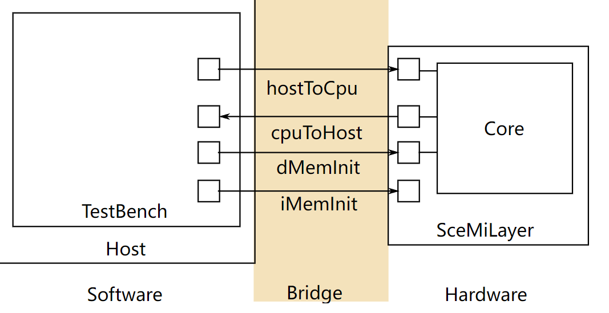

# 实验 5: RISC-V 引介 - 多周期与两阶段流水线

> **实验 5截止日期**：2016年10月24日，美东时间晚上11:59:59。
>
> 本实验的交付物包括：
>
> - 在 `TwoCycle.bsv`、`FourCycle.bsv`、`TwoStage.bsv` 和 `TwoStageBTB.bsv` 中完成练习1-4的答案
> - 在 `discussion.txt` 中完成讨论问题1-4的答案

## 引言

本实验介绍了 RISC-V 处理器及其相关工具流。实验从介绍 RISC-V 处理器的单周期实现开始。然后你将创建两周期和四周期的实现，这些实现是由于内存结构危害驱动的。你将完成创建两阶段流水线的实现，使取指和执行阶段并行进行。这种两阶段流水线将成为未来流水线实现的基础。

## 处理器基础设施

在设置运行、测试、评估性能和调试你的 RISC-V 处理器的基础设施方面，已经为你完成了大量工作，无论是在仿真中还是在 FPGA 上。由于使用的内存类型，本实验的处理器设计无法在 FPGA 上运行。

### 初始代码

本实验提供的代码包含三个目录：

- `programs/` 包含 RISC-V 程序的汇编和 C 语言版本。
- `scemi/` 包含编译和仿真处理器的基础设施。
- `src/` 包含 RISC-V 处理器的 BSV 代码。

在 BSV 源文件夹中，有一个 `src/includes/` 文件夹，其中包含用于 RISC-V 处理器的所有模块的 BSV 代码。你在本实验中不需要更改这些文件。这些文件简要说明如下。

| 文件名              | 内容                                               |
| :------------------ | :------------------------------------------------- |
| `Btb.bsv`           | 分支目标缓冲区地址预测器的实现。                   |
| `CsrFile.bsv`       | 实现 CSR（包括与主机机器通信的 `mtohost`）。       |
| `DelayedMemory.bsv` | 实现具有一周期延迟的内存。                         |
| `DMemory.bsv`       | 使用大型寄存器文件实现数据内存，具有组合读写功能。 |
| `Decode.bsv`        | 指令解码的实现。                                   |
| `Ehr.bsv`           | 如讲座中所述，使用 EHRs 实现。                     |
| `Exec.bsv`          | 指令执行的实现。                                   |
| `Fifo.bsv`          | 如讲座中所述，使用 EHRs 实现各种 FIFO。            |
| `IMemory.bsv`       | 使用大型寄存器文件实现具有组合读功能的指令内存。   |
| `MemInit.bsv`       | 模块用于从主机 PC 下载指令和数据存储器的初始内容。 |
| `MemTypes.bsv`      | 与内存相关的常见类型。                             |
| `ProcTypes.bsv`     | 与处理器相关的常见类型。                           |
| `RFile.bsv`         | 寄存器文件的实现。                                 |
| `Types.bsv`         | 常见类型。                                         |

### SceMi 设置

|  |
| ------------------------------------------------------------ |
| 图 1: SceMi 设置                                             |

图 1 显示了本实验的 SceMi 设置。在设计和调试处理器时，我们经常需要另一个处理器的帮助，我们称之为*宿主*处理器（图 1 中标记为 "Host"）。为了与宿主区分，我们

可以将你设计的处理器（图 1 中标记为 "Core"）称为*目标*处理器。SceMiLayer 实例化来自指定处理器 BSV 文件的处理器和 SceMi 端口，用于处理器的 hostToCpu、cpuToHost、iMemInit 和 dMemInit 接口。SceMiLayer 还提供了一个 SceMi 端口，用于从测试台重置核心，允许在处理器上运行多个程序，而无需重新配置 FPGA。

由于我们只在本实验中在仿真中运行处理器，我们将绕过通过 iMemInit 和 dMemInit 接口初始化内存的耗时阶段。相反，我们将在仿真开始时直接使用内存初始化文件（.vmh 文件，介绍在[编译汇编测试和基准测试](http://csg.csail.mit.edu/6.175/archive/2016/labs/lab5-riscv-intro.html#prog)中）加载内存所需的值，并将为每个程序重新启动仿真。

SceMiLayer 和 Bridge 的源代码位于 `scemi/` 目录中。SceMi 链接在仿真时使用 TCP 桥，在实际 FPGA 上运行时使用 PCIe 桥。

### 构建项目

文件 `scemi/sim/project.bld` 描述了如何使用 `build` 命令构建项目，该命令是 Bluespec 安装的一部分。运行

```
build --doc
```

以获取有关 `build` 命令的更多信息。可以通过在 `scemi/sim/` 目录中运行以下命令从头开始重新构建整个项目，其中 `<proc_name>` 是本实验指南中指定的处理器名称之一。这将覆盖之前通过 `build` 调用生成的可执行文件。

> **旁注**：单独运行 `build -v` 会打印一个错误消息，其中包含所有有效的处理器名称。

### 编译汇编测试和基准测试

我们的 SceMi 测试台运行指定为 Verilog Memory Hex (vmh) 格式的 RISC-V 程序。`programs/assembly` 目录包含汇编测试的源代码，而 `programs/benchmarks` 目录包含基准程序的源代码。我们将使用这些程序来测试处理器的正确性和性能。每个目录下都提供了一个 Makefile，用于生成 `.vmh` 格式的程序。

要编译所有汇编测试，请转到 `programs/assembly` 目录并运行 `make`。这将创建一个名为 `programs/build/assembly` 的新目录，其中包含所有汇编测试的编译结果。其下的 `vmh` 子目录包含所有的 .vmh 文件，而 `dump` 子目录包含所有转储的汇编代码。如果您忘记了这样做，将会看到以下错误消息：

```
-- assembly test: simple --
ERROR: ../../programs/build/assembly/vmh/simple.riscv.vmh does not exit, you need to first compile
```

同样，转到 `programs/benchmarks` 直接运行 `make` 命令来编译所有基准测试。编译结果将位于 `programs/build/benchmarks` 目录中。

现在编译汇编测试和基准测试。RISC-V 工具链应该能在所有 vlsifarm 机器上运行，但可能*不*适用于普通的 Athena 集群机器。我们建议您至少*最初*在 vlsifarm 机器上编译这些程序，然后，您可以使用普通的 Athena 集群机器来完成本实验。

`programs/build/assembly/vmh` 目录中的 .vmh 文件是汇编测试，它们如下介绍：

| 文件名             | 内容           |
| :----------------- | :------------- |
| `simple.riscv.vmh` | 包含汇编测试的 |

基本基础代码，并运行 100 条 NOP 指令（"NOP" 代表 "无操作"）。 |
| `bpred_bht.riscv.vmh`   | 包含许多分支历史表可以很好预测的分支。                       |
| `bpred_j.riscv.vmh`     | 包含许多跳转指令，分支目标缓冲区可以很好地预测。             |
| `bpred_ras.riscv.vmh`   | 包含许多通过寄存器进行的跳转，返回地址栈可以很好地预测。     |
| `cache.riscv.vmh`       | 通过对别名在较小内存中的地址进行读写来测试缓存。             |
| `<inst>.riscv.vmh`      | 测试特定指令。                                               |

每个汇编测试都会打印周期计数、指令计数和测试是否通过。simple.riscv.vmh 在单周期处理器上的示例输出为

```
102
103
PASSED
```

第一行是周期计数，第二行是指令计数，最后一行显示测试通过。指令计数比周期计数大，因为我们在读取周期计数 CSR（`cycle`）后读取指令计数 CSR（`instret`）。如果测试失败，最后一行将是

```
FAILED exit code = <failure code>
```

可以使用失败代码通过查看汇编测试的源代码来定位问题。

我们强烈建议在对处理器进行任何更改后重新运行所有汇编测试，以验证您没有破坏任何内容。当试图定位错误时，运行汇编测试将缩小问题指令的可能性。

`programs/build/benchmarks/` 中的基准测试评估处理器的性能。这些基准测试简要介绍如下：

| 文件名               | 功能                   |
| :------------------- | :--------------------- |
| `median.riscv.vmh`   | 一维三元素中值过滤器。 |
| `multiply.riscv.vmh` | 软件乘法。             |
| `qsort.riscv.vmh`    | 快速排序。             |
| `towers.riscv.vmh`   | 汉诺塔。               |
| `vvadd.riscv.vmh`    | 向量-向量加法。        |

每个基准测试都会打印其名称、周期计数、指令计数、返回值以及是否通过。单周期处理器上中值基准测试的示例输出为

```
Benchmark median
Cycles = 4014
Insts  = 4015
Return 0
PASSED
```

如果基准测试通过，最后两行应为 `Return 0` 和 `PASSED`。如果基准测试失败，最后一行将是

```
FAILED exit code = <failure code>
```

性能以每周期指令数 (IPC) 衡量，我们通常希望提高 IPC。对于我们的流水线，IPC 永远不会超过 1，但我们应该能够通过良好的分支预测器和适当的旁路接近它。

### 使用测试台

我们的 SceMi 测试台是在宿主处理器上运行的软件，通过 SceMi 链接与 RISC-V 处理器交互，如图 1 所示。测试台启动处理器并处理 `toHost` 请求，直到处理器表明已成功或未成功完成。例如，测试输出中的周期计数实际上是处理器发出的 `toHost` 请求，请求打印一个整数，测试台通过打印该整数来处理这些请求。测试输出的最后一行（即 `PASSED` 或 `FAILED`）也是由测试台根据指示处理完成的 `toHost` 请求打印出来的。

要运行测试台，请首先按照[构建项目](<http://csg.csail.mit.edu>

/6.175/archive/2016/labs/lab5-riscv-intro.html#build)中的描述构建项目，并按照[编译汇编测试和基准测试](http://csg.csail.mit.edu/6.175/archive/2016/labs/lab5-riscv-intro.html#prog)中的描述编译 RISC-V 程序。对于仿真，将创建可执行文件 `bsim_dut`，在启动测试台时应运行此文件。在仿真中，我们的 RISC-V 处理器总是加载文件 `scemi/sim/mem.vmh` 来初始化（数据）内存。因此，我们只需要复制我们想要运行的测试程序的 .vmh 文件（对应于指令内存）即可。

例如，要在仿真中在处理器上运行中值基准测试，你可以在 `scemi/sim` 目录下使用以下命令：

```
cp ../../programs/build/benchmarks/vmh/median.riscv.vmh mem.vmh
./bsim_dut > median.out &
./tb
```

为方便起见，我们在 `scemi/sim` 目录中提供了脚本 `run_asm.sh` 和 `run_bmarks.sh`，分别运行所有汇编测试和基准测试。`bsim_dut` 的标准输出（stdout）将重定向到 `logs/<test name>.log` 文件。

### 测试台输出

RISC-V 仿真有两个输出来源。这些包括 BSV `$display` 语句（包括消息和错误）和 RISC-V 打印语句。

BSV `$display` 语句由 `bsim_dut` 打印到 stdout。BSV 还可以使用 `$fwrite(stderr, ...)` 语句将内容打印到标准错误（stderr）。`run_asm.sh` 和 `run_bmarks.sh` 脚本将 `bsim_dut` 的 stdout 重定向到 `logs/<test name>.log` 文件。

RISC-V 打印语句（例如，`programs/benchmarks/common/syscall.c` 中的 `printChar`、`printStr` 和 `printInt` 函数）通过将字符和整数移至 `mtohost` CSR 来处理。测试台从 `cpuToHost` 接口读取，并在接收到字符和整数时将它们打印到 stderr。

> **练习 0（0 分）**： 通过转到 `programs/assembly` 和 `programs/benchmarks` 目录并运行 `make` 编译测试程序。在 `scemi/sim` 目录中编译单周期 RISC-V 实现并通过以下命令测试它：
>
> ```
> $ build -v onecycle
> $ ./run_asm.sh
> $ ./run_bmarks.sh
> ```
>
> 在编译 BSV 代码（即 `build -v onecycle`）期间，你可能会看到许多警告，出现在 "code generation for mkBridge starts" 之后。这些警告针对的是 SceMi 基础设施，通常你不需要关心它们。

> **实用提示**： 在 `scemi/sim` 目录中运行
>
> ```
> $ ./clean
> ```
>
> 将删除使用 `build` 构建的任何文件。

### 应对 AFS 超时问题

在运行构建工具时，AFS 超时错误可能如下所示：

```
   ...
code generation for mkBypassRFile starts
Error: Unknown position: (S0031)
  Could not write the file `bdir_dut/mkBypassRFile.ba':
    timeout
tee: ./onecycle_compile_for_bluesim.log: Connection timed out
!!! Stage compile_for_bluesim command encountered an error -- aborting build.
!!! Look in the log file at ./onecycle_compile_for_bluesim.log for more information.
```

由于各种原因，AFS 可能会超时，导致你的 Bluespec 构建失败。我们可以将构建目录移到 AFS 之外的位置，这可以缓解这个问题。首先，在 `/tmp` 中创建一个目

录：

```
mkdir /tmp/<your_user_name>-lab5
```

然后，打开 `scemi/sim/project.bld`，你会发现以下行：

```
[common]
hide-target
top-module:             mkBridge
top-file:               ../Bridge.bsv
bsv-source-directories: ../../scemi ../../src ../../src/includes
verilog-directory:      vlog_dut
binary-directory:       bdir_dut
simulation-directory:   simdir_dut
info-directory:         info_dut
altera-directory:       quartus
xilinx-directory:       xilinx
scemi-parameters-file:  scemi.params
```

将 `verilog-directory`、`binary-directory`、`simulation-directory` 和 `info-directory` 更改为包含新的临时目录。例如，如果你的用户名是 "alice"，你的新文件夹将是：

```
verilog-directory:      /tmp/alice-lab5/vlog_dut
binary-directory:       /tmp/alice-lab5/bdir_dut
simulation-directory:   /tmp/alice-lab5/simdir_dut
info-directory:         /tmp/alice-lab5/info_dut
```

完成本实验后，请记得删除你的 `tmp` 目录。如果你忘记了哪个临时目录是你的，查看 `project.bld` 或使用 `ls -l` 找到带有你的用户名的那个。

## 多周期 RISC-V 实现

提供的代码 `src/OneCycle.bsv` 实现了一个单周期哈佛架构 RISC-V 处理器。（哈佛架构具有独立的指令和数据存储器。）这个处理器能够在一个周期内完成操作，因为它具有独立的指令和数据存储器，且每个存储器在同一周期内对加载给出响应。在本实验的这一部分，你将制作两种不同的多周期实现，这些实现是由更现实的内存结构危害驱动的。

### 两周期冯·诺依曼架构 RISC-V 实现

哈佛架构的一种替代方案是冯·诺依曼架构。（冯·诺依曼架构也称为普林斯顿架构。）冯·诺依曼架构将指令和数据存储在同一内存中。如果只有一个内存同时保存指令和数据，则存在结构危害（假设内存不能在同一周期内被访问两次）。要解决这个危害，你可以将处理器分成两个周期：*指令取取* 和 *执行*。

1. 在*指令取取*阶段，处理器从内存中读取当前指令并对其进行解码。
2. 在*执行*阶段，处理器读取寄存器文件、执行指令、进行 ALU 操作、进行内存操作，并将结果写入寄存器文件。

创建两周期实现时，你将需要一个寄存器来在两个阶段间保持中间数据，以及一个状态寄存器来跟踪当前状态。中间数据寄存器将在指令取取期间被写入，在执行期间被读取。状态寄存器将在指令取取和执行之间切换。为了简化操作，你可以使用提供的 `Stage` 类型定义作为状态寄存器的类型。

> **练习 1（15 分）**： 在 `TwoCycle.bsv` 中实现一个两周期 RISC-V 处理器，使用单一内存来存储指令和数据。已为你提供了单一内存模块 `mem` 供使用。通过转到 `scemi/sim` 目录并使用以下命令测试此处理器：
>
> ```
> $ build -v twocycle
> $ ./run_asm.sh
> $ ./run_bmarks.sh
> ```

### 四周期 RISC-V 实现，支持内存延迟

一周期和两周期 RISC-V 处理器假设内存具有组合读取功能；即如果你设置读取地址，那么读取的数据将在同一时钟周期内有效。大多数内存的读取具有更长的延迟：首先你设置地址位，然后在下一个时钟周期中读取结果才准备好。如果我们将之前 RISC-V 处理器实现中的内存更改为具有读取延迟的内存，那么我们将引入另一个结构危害：读取的结果不能在执行读取的同一周期中使用。这种结构危害可以通过将处理器进一步分成四个周期来避免：*指令取取*、*指令解码*、*执行* 和 *写回*。

1. *指令取取*阶段，如前所述，将地址线设置在内存的 `PC` 上以读取当前指令。
2. *指令解码*阶段从内存获取指令、解码并读取寄存器。
3. *执行*阶段进行 ALU 操作，为存储指令写入数据到内存，并为读取指令设置内存地址线。
4. *写回*阶段从 ALU 获取结果或从内存读取结果（如果有的话）并写入寄存器文件。

这种处理器将需要更多的阶段间寄存器和扩展的状态寄存器。你可以使用修改过的 `Stage` 类型定义作为状态寄存器的类型。

由 `mkDelayedMemory` 实现的一周期读取延迟内存。此模块具有一个接口 `DelayedMemory`，该接口将内存请求和内存响应分离。请求仍以使用 `req` 方法的相同方式进行，但此方法不再同时返回响应。为了获取上一次读取请求的结果，你必须在稍后的时钟周期中调用 `resp` 动作值方法。存储请求不会生成任何响应，因此你不应为存储调用 `resp` 方法。更多细节可以在 `src/includes` 中的源文件 `DelayedMemory.bsv` 中找到。

> **练习 2（15 分）**：
>
> 如上所述，在 `FourCycle.bsv` 中实现一个四周期 RISC-V 处理器。使用已包含在 `FourCycle.bsv` 中的延迟内存模块 `mem` 作为指令和数据内存。使用以下命令测试此处理器：
>
> ```
> $ build -v fourcycle
> $ ./run_asm.sh
> $ ./run_bmarks.sh
> ```

## 两阶段流水线 RISC-V 实现

虽然两周期和四周期实现允许处理器处理某些结构危害，但它们的性能并不理想。今天的所有处理器都是流水线化的，以提高性能，它们通常具有重复的硬件来避免诸如两周期和四周期 RISC-V 实现中所见的内存危害之类的结构危害。流水线引入了更多的数据和控制危害，处理器必须处理。为了避免数据危害，我们现在只研究两阶段流水线。

两阶段流水线使用两周期实现将工作分成两个阶段的方式，并使用独立的指令和数据内存并行运行这些阶段。这意味着当一条指令正在执行时，下一条指令正在被取出。对于分支指令，下一条指令并不总是已知的。这被称为*控制危害*。

为了处理这种控制危害，请在取指阶段使用 PC+4 预测器，并在*分支错误预测*发生

时纠正 PC。`ExecInst` 的 `mispredict` 字段在此处将非常有用。

> **练习 3（30 分）**：
>
> 在 `TwoStage.bsv` 中实现一个两周期流水线 RISC-V 处理器，使用独立的指令和数据内存（具有组合读取功能，就像 `OneCycle.bsv` 中的内存一样）。你可以实现非弹性或弹性流水线。使用以下命令测试此处理器：
>
> ```
> $ build -v twostage
> $ ./run_asm.sh
> $ ./run_bmarks.sh
> ```

### 每周期指令数（IPC）

处理器性能通常以每周期指令数 (IPC) 衡量。这个指标是吞吐量的度量，即平均每周期完成的指令数。要计算 IPC，请将完成的指令数除以完成它们所需的周期数。单周期实现的 IPC 为 1.0，但它将不可避免地需要一个长的时钟周期来考虑传播延迟。结果，我们的单周期处理器并不像听起来那么快。两周期和四周期实现分别达到 0.5 和 0.25 的 IPC。

流水线实现的处理器将实现 0.5 到 1.0 IPC 之间的某处。分支错误预测会降低处理器的 IPC，因此你的 PC+4 下一地址预测器的准确性对于拥有高 IPC 的处理器至关重要。

> **讨论问题 1（5 分）**： 对于 `run_bmarks.sh` 脚本测试的每个基准测试，两阶段流水线处理器的 IPC 是多少？

> **讨论问题 2（5 分）**： 从 IPC 计算下一地址预测器准确性的公式是什么？（提示，当 PC+4 预测正确时，执行一条指令需要多少周期？当预测错误时呢？）使用这个公式，每个基准测试的 PC+4 下一地址预测器的准确性是多少？

### 下一地址预测

现在，让我们使用更高级的下一地址预测器。其中一个例子是分支目标缓冲区 (BTB)。它根据当前的程序计数器 (PC) 的值预测要取出的下一条指令的位置。对于绝大多数指令来说，这个地址是 PC + 4（假设所有指令都是 4 字节）。但是，对于跳转和分支指令来说，情况并非如此。因此，BTB 包含了之前使用过的不仅仅是 PC+4 的下一个地址（“分支目标”）的表，以及生成这些分支目标的 PC。

`Btb.bsv` 包含了一个 BTB 的实现。其接口有两个方法：`predPc` 和 `update`。方法 `predPc` 接受当前 PC 并返回一个预测。方法 `update` 接受一个程序计数器和该程序计数器的指令的下一个地址，并将其添加为预测（如果不是 PC+4 的话）。

应当调用 `predPc` 方法来预测下一个 PC，而在分支解析后应调用 `update` 方法。执行阶段需要当前指令的 PC 和预测的 PC 来解析分支，因此你需要在流水线寄存器或 FIFO 中存储这些信息。

`ExecInst` 的 `mispredict` 和 `addr` 字段在这里将非常有用。需要注意的是，`addr` 字段并不总是下一条指令的正确 PC——它将是内存加载和存储的地址。我们可以进行高级推理，得出加载和存储从不出现错误的下一 PC 预

测，或者我们可以在执行阶段检查指令类型以得出下一 PC。

> **练习 4（10 分）**： 在 `TwoStageBTB.bsv` 中，为你的两周期流水线 RISC-V 处理器添加一个 BTB。BTB 模块已在给定代码中实例化。使用以下命令测试此处理器：
>
> ```
> $ build -v twostagebtb
> $ ./run_asm.sh
> $ ./run_bmarks.sh
> ```

> **讨论问题 3（5 分）**： 使用 BTB 的两阶段流水线处理器的 IPC 是多少，对于 `run_bmarks.sh` 脚本测试的每个基准测试而言，它有多大改进？

> **讨论问题 4（5 分）**： 添加 BTB 如何改变 `bpred_*` 微基准测试的性能？（提示：`bpred_j` 的周期数应该减少。）

> **讨论问题 5（可选）**： 完成这个实验你花了多长时间？

完成后记得使用 `git push` 推送你的代码。

### 额外讨论问题

> **讨论问题 6（5 额外分）**： 查看 `bpred_*` 基准测试的汇编源代码并解释为什么每个基准测试改进、保持不变或变得更糟。

> **讨论问题 7（5 额外分）**： 你会如何改进 BTB 以改善 `bpred_bht` 的结果？

------

© 2016 [麻省理工学院](http://web.mit.edu/)。保留所有权利。
