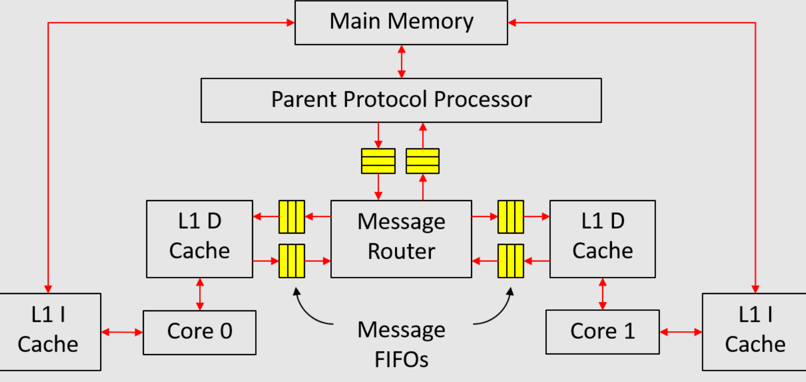
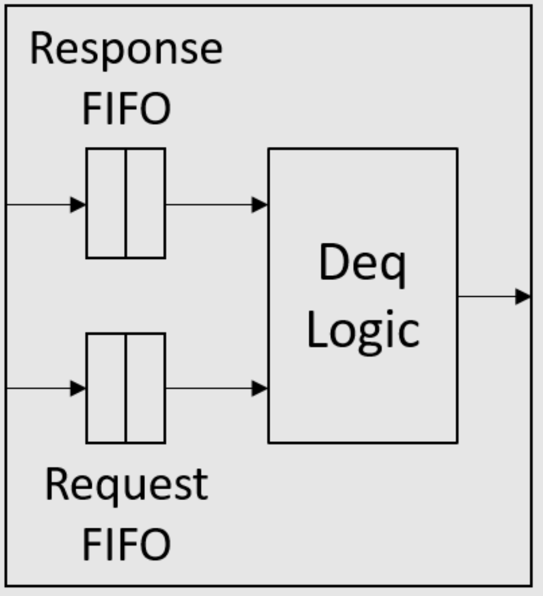

# 项目2: 缓存一致性

> 这部分以及项目的第一部分将在**12月14日，星期三下午3点EST**举行的项目展示中到期。

## 概述

在本项目部分，我们将在仿真中实现一个多核系统，如图1所示。该系统由两个核心组成，每个核心都有自己的私有缓存。数据缓存（D缓存）和主内存通过课堂上介绍的MSI协议保持一致。由于我们没有自修改程序，指令缓存（I缓存）可以直接访问内存，无需经过任何一致性事务。

|  |
| ------------------------------------------------------------ |
| 图1：多核系统                                                |

由于该系统相当复杂，我们尝试将实现分为多个小步骤，并为每个步骤提供了测试台。但是，通过测试台**并不**意味着实现是100％正确的。

## 实现存储层次结构的单元

### 消息FIFO

消息FIFO传输请求和响应消息。对于从子级到父级的消息FIFO，它传输升级请求和降级响应。对于从父级到子级的消息FIFO，它传输降级请求和升级响应。

消息FIFO传输的消息类型在`src/includes/CacheTypes.bsv`中定义如下：

```rust
typedef struct {
  CoreID            child;
  Addr              addr;
  MSI               state;
  Maybe#(CacheLine) data;
} CacheMemResp deriving(Eq, Bits, FShow);

typedef struct {
  CoreID      child;
  Addr        addr;
  MSI         state;
} CacheMemReq deriving(Eq, Bits, FShow);

typedef union tagged {
  CacheMemReq     Req;
  CacheMemResp    Resp;
} CacheMemMessage deriving(Eq, Bits, FShow);
```

`CacheMemResp`是从子级到父级的降级响应以及从父级到子级的升级响应的类型。第一个字段`child`是消息传递中涉及的D缓存的ID。`CoreID`类型在`Types.bsv`中定义。第三个字段`state`是子级为降级响应降级到的MSI状态，或子级可以为升级响应升级到的MSI状态。

`CacheMemReq`是从子级到父级的升级请求和从父级到子级的降级请求的类型。第三个字段`state`是子级想要为升级请求升级到的MSI状态，或子级应该为降级请求降级到的MSI状态。

消息FIFO的接口也在`CacheTypes.bsv`中定义：

```rust
interface MessageFifo#(numeric type n);
  method Action enq_resp(CacheMemResp d);
  method Action enq_req(CacheMemReq d);
  method Bool hasResp;
  method Bool hasReq;
  method Bool notEmpty;
  method CacheMemMessage first;
  method Action deq;
endinterface
```

接口有两个入队方法（`enq_resp`和`enq_req`），一个用于请求，另一个用于响应。布尔标志`hasResp`和`hasReq`分别表示FIFO中是否有任何响应或请求。`notEmpty`标志只是`hasResp`和`hasReq`的或运算。接口只有一个`first`和一个`deq`方法，一次检索一条消息。

如课堂上所述，当它们都位于同一个消息FIFO中时，请求永远不应阻止响应。为了确保这一点，我们可以使用两个FIFO实现消息FIFO，如图2所示。在入队端，所有请求都入队到请求FIFO，而所有响应都入队到另一个响应

FIFO。在出队端，响应FIFO优先于请求FIFO，即只要响应FIFO不为空，`deq`方法就应该出队响应FIFO。接口定义中的数值类型`n`是响应/请求FIFO的大小。

|  |
| ------------------------------------------------------------ |
| 图2：消息FIFO的结构                                          |

> **练习1（10分）：**在`src/includes/MessageFifo.bsv`中实现消息FIFO（`mkMessageFifo`模块）。我们在`unit_test/message-fifo-test`文件夹中提供了一个简单的测试。使用`make`编译，并使用`./simTb`运行测试。

### 消息路由器

消息路由器连接所有L1 D缓存和父协议处理器。我们将在`src/includes/MessageRouter.bsv`中实现这个模块。它声明为：

```
module mkMessageRouter(
  Vector#(CoreNum, MessageGet) c2r, Vector#(CoreNum, MessagePut) r2c, 
  MessageGet m2r, MessagePut r2m,
  Empty ifc 
);
```

`MessageGet`和`MessagePut`接口只是`MessageFibo`接口的限制视图，它们在`CacheTypes.bsv`中定义：

```
interface MessageGet;
  method Bool hasResp;
  method Bool hasReq;
  method Bool notEmpty;
  method CacheMemMessage first;
  method Action deq;
endinterface
interface MessagePut;
  method Action enq_resp(CacheMemResp d);
  method Action enq_req(CacheMemReq d);
endinterface
```

我们提供了`toMessageGet`和`toMessagePut`函数，将`MessageFifo`接口转换为`MessageGet`和`MessagePut`接口。以下是每个模块参数的介绍：

- `c2r`是每个L1 D缓存的消息FIFO的接口。
- `r2c`是到每个L1 D缓存的消息FIFO的接口。
- `m2r`是来自父协议处理器的消息FIFO的接口。
- `r2m`是到父协议处理器的消息FIFO的接口。

此模块的主要功能分为两部分：

1. 将消息从父级（`m2r`）发送到正确的L1 D缓存（`r2c`），
2. 将消息从L1 D缓存（`c2r`）发送到父级（`r2m`）。

应该注意的是，响应消息优先于请求消息，就像消息FIFO中的情况一样。

> **练习2（10分）：**在`src/includes/MessageRouter.bsv`中实现`mkMessageRouter`模块。我们在`unit_test/message-router-test`文件夹中提供了一个简单的测试。运行以下命令进行编译和运行：
>
> ```
> $ make
> $ ./simTb
> ```

### L1数据缓存

阻塞L1 D缓存（*不带*存储队列）将在`src/includes/DCache.bsv`中实现：

```
module mkDCache#(CoreID id)(MessageGet fromMem, MessagePut toMem, RefDMem refDMem, DCache ifc);
```

以下是每个模块参数和参数的介绍：

- `id`是核心ID，它将附加到发送到父协议处理器的每条消息上。
- `fromMem`是来自父协议处理器的消息FIFO的接口（或更准确地说是消息路由器），因此可以从此接口读出降级请求和升级响应。
- `toMem`是到父协议处理器的消息FIFO的接口，因此应将升级请求和降级响应发送到此接口。
- `refDMem`用于调试，目前你不需要担心它。

模块返回的`

DCache`接口在`CacheTypes.bsv`中定义如下：

```
interface DCache;
  method Action req(MemReq r);
  method ActionValue#(MemResp) resp;
endinterface
```

你可能已经注意到`MemOp`类型（在`MemTypes.bsv`中定义），它是`MemReq`结构体（在`MemTypes.bsv`中定义）的`op`字段的类型，现在有五个值：`Ld, St, Lr, Sc`和`Fence`。现在你只需要处理`Ld`和`St`请求。你可以在`DCache`接口的`req`方法中添加逻辑，如果检测到除`Ld`或`St`之外的请求则报告错误。

`MemReq`类型还有一个新字段`rid`，这是用于调试的请求ID。`rid`是`Bit\#(32)`类型，对于同一核心的每个请求应该是唯一的。

我们将实现一个16条目直接映射的L1 D缓存（缓存行数定义为`CacheTypes.bsv`中的类型`CacheRows`）。我们建议使用寄存器向量来实现缓存数组以分配初始值。我们还在`CacheTypes.bsv`中提供了一些有用的函数。

`MSI`状态类型在`CacheTypes.bsv`中定义：

```
typedef enum {M, S, I} MSI deriving(Bits, Eq, FShow);
```

我们使`MSI`类型成为`Ord`类型类的一个实例，因此我们可以在它上面应用比较运算符（`>, <, >=, <=`等）。顺序是`M > S > I`。

> **练习3（10分）：**在`src/includes/DCache.bsv`中实现`mkDCache`模块。这应该是一个*不带*存储队列的阻塞缓存。你可能想使用最终项目第一部分练习1中的变通方法，以避免将来在D缓存集成到处理器流水线时的调度冲突。我们在`unit_test/cache-test`文件夹中提供了一个简单的测试。要编译和测试，请运行
>
> ```
> $ make
> $ ./simTb
> ```

### 父协议处理器

父协议处理器将在`src/includes/PPP.bsv`中实现：

```
module mkPPP(MessageGet c2m, MessagePut m2c, WideMem mem, Empty ifc);
```

以下是每个模块参数的介绍：

- `c2m`是来自L1 D缓存的消息FIFO的接口（实际上来自消息路由器），可以从此接口读出升级请求和降级响应。
- `m2c`是到L1 D缓存的消息FIFO的接口（实际上到消息路由器），应将降级请求和升级响应发送到此接口。
- `mem`是主内存的接口，我们已经在项目的第一部分中使用过。

在讲座中，父协议处理器中的目录记录了每个可能地址的MSI状态。然而，对于32位地址空间，这将占用大量存储空间。为了减少目录所需的存储量，我们注意到我们只需要跟踪存在于L1 D缓存中的地址。具体来说，我们可以按照以下方式实现目录：

```
Vector#(CoreNum, Vector#(CacheRows, Reg#(MSI))) childState <- replicateM(replicateM(mkReg(I)));
Vector#(CoreNum, Vector#(CacheRows, Reg#(CacheTag))) childTag <- replicateM(replicateM(mkRegU));
```

当父协议处理器想要了解核心`i`上地址`a`的大致MSI状态时，它可以首先读出`tag=childTag[i][getIndex(a)]`。如果`tag`与`getTag(a)`不匹配，则MS

I状态必须是`I`。否则，状态应该是`childState[i][getIndex(a)]`。通过这种方式，我们大大减少了目录所需的存储量，但我们需要在子状态发生任何变化时维护`childTag`数组。

与讲座中的另一个不同之处在于，主内存数据应使用`mem`接口访问，而讲座只是假设组合读取数据。

> **练习4（10分）：**在`src/includes/PPP.bsv`中实现`mkPPP`模块。我们在`unit_test/ppp-test`文件夹中提供了一个简单的测试。使用`make`编译，并使用`./simTb`运行测试。

## 测试整个存储层次结构

既然我们已经构建了存储系统的每个部分，现在我们将它们放在一起，并使用`uint_test/sc-test`文件夹中的测试台测试整个存储层次结构。测试将利用`mkDCache`的"`RefDMem refDMem`"参数，并且我们需要在`mkDCache`中添加一些对`refDMem`方法的调用。`refDMem`由一个用于一致内存的参考模型（在`src/ref/RefSCMem.bsv`中的`mkRefSCMem`）返回，该模型可以基于对`refDMem`方法的调用检测一致性违规。`RefDMem`在`src/ref/RefTypes.bsv`中定义如下：

```
interface RefDMem;
  method Action issue(MemReq req);
  method Action commit(MemReq req, Maybe#(CacheLine) line, Maybe#(MemResp) resp);
endinterface
```

对于`mkDCache`中的`req`方法中的每个请求，都应调用`issue`方法：

```
method Action req(MemReq r);
  refDMem.issue(r);
  // 然后处理r
endmethod
```

这将告诉参考模型发送到D缓存的所有请求的程序顺序。

当请求处理完成时，应调用`commit`方法，即当`Ld`请求获得加载结果或`St`请求写入缓存的数据数组时。以下是`commit`的每个方法参数的介绍：

- `req`是正在提交（即完成处理）的请求。

- `line`是`req`正在访问的缓存行的原始值。这里的缓存行是指具有行地址`getLineAddr(req.addr)`的64B数据块。因此，它不一定是指D缓存中的行，因为D缓存可能只包含垃圾数据。由于`line`是原始值，在提交存储请求的情况下，它应该是存储修改之前的值。

  如果我们知道缓存行数据，`line`应设置为`tagged Valid`。否则，我们将`line`设置为`tagged Invalid`。在`mkDCache`的情况下，当请求提交时，我们总是知道缓存行数据，因为它要么已经在D缓存中，要么在来自父级的升级响应中。因此，`line`应始终设置为`tagged Valid`。

- `resp`是发送回核心的`req`的响应。如果有响应发送回核心，则`resp`应为`tagged Valid response`；否则应为`tagged Invalid`。对于`Ld`请求，`resp`应为`tagged Valid (load result)`。对于`St`请求，`resp`应为`tagged Invalid`，因为D缓存从不为`St`请求发送响应。

当`mkDCache`调用`commit(req, line, resp)`方法时，一致内存的参考模型将检查以下事项：

1. 是否可以提交`req`。如果`req`尚未发出（即从未为`req`调用`issue`方法），或者同一核心的一些较

旧请求尚未提交（即非法重新排序内存请求），则不能提交`req`。
2. 缓存行值`line`是否正确。如果`line`是`Invalid`，则不执行检查。
3. 响应`resp`是否正确。

`uint_test/sc-test`文件夹中的测试台实例化了一个完整的内存系统，并向每个L1 D缓存提供随机请求。它依赖于参考模型来检测内存系统内部的一致性违规。

> **练习5（10分）：**在`src/includes/DCache.bsv`中的`mkDCache`模块中添加对`refDMem`方法的调用。然后进入`uint_test/sc-test`文件夹，使用`make`编译测试台。这将创建两个仿真二进制文件：`simTb_2`用于两个D缓存，`simTb_4`用于四个D缓存。你也可以分别通过`make tb_2`和`make tb_4`编译它们。
>
> 运行测试：
>
> ```
> $ ./simTb_2 > dram_2.txt
> ```
>
> 和
>
> ```
> $ ./simTb_4 > dram_4.txt
> ```
>
> `dram_*.txt`将包含`mkWideMemFromDDR3`模块的调试输出，即与主内存的请求和响应。主内存由`mem.vmh`初始化，这是一个空的VMH文件。这将初始化主内存的每个字节为`0xAA`。

请求发送到D缓存`i`的跟踪可以在`driver_<i>_trace.out`中找到。

## 测试程序

我们可以使用以下命令编译测试程序：

```shell
$ cd programs/assembly
$ make
$ cd ../benchmarks
$ make
$ cd ../mc_bench
$ make
$ make -f Makefile.tso
```

`programs/assembly` 和 `programs/benchmarks` 包含单核心的汇编和基准测试程序。在这些程序中，只有核心0会执行程序，而核心1将在启动后不久进入 `while(1)` 循环。

`programs/mc_bench` 包含多核基准测试程序。在这些程序的主函数中，首先获取核心ID（即 `mhartid` CSR），然后根据核心ID跳转到不同的函数。一些程序只使用普通的加载和存储，而其他程序则使用原子指令（加载保留和条件存储）。

我们已经在 `scemi/sim` 文件夹中提供了多个脚本来运行测试程序。这些脚本都可以用以下方式调用：

```
$ ./<script name>.sh <proc name>
```

## 将处理器集成到存储层次结构中

在测试存储系统之后，我们开始将其集成到多核系统中。我们已经在 `src/Proc.bsv` 中提供了多核系统的代码，其中实例化了一致内存的参考模型、主内存、核心、消息路由器和父协议处理器。我们已经讨论了 `Proc.bsv` 中的所有内容，除了核心（`mkCore` 模块）。我们将使用两种类型的核心：三周期核心和六阶段流水线核心。`Proc.bsv` 中的宏 `CORE_FILE` 控制我们使用哪种类型的核心。

请注意，`Proc.bsv` 中有两种类型的参考模型，`mkRefSCMem` 和 `mkRefTSOMem`，实例化由一些宏控制。`mkRefSCMem` 是没有任何存储队列的阻塞缓存的内存系统的参考模型，而 `mkRefTSOMem` 是包含存储队列的缓存的内存系统的参考模型。目前我们将使用 `mkRefSCMem`，因为我们还没有在我们的缓存中引入存储队列。

### 三周期核心

我们已经在 `src/ThreeCycle.bsv` 中提供了三周期核心的实现：

```
module mkCore#(CoreID id)(WideMem iMem, RefDMem refDMem, Core ifc);
```

`iMem` 参数传递给 I 缓存（与项目第一部分的 I 缓存相同）。由于 I 缓存数据本质上是一致的，它可以直接将 `refDMem` 参数传递给 D 缓存，以便我们可以借助参考模型进行调试。`Core` 接口在 `src/includes/ProcTypes.bsv` 中定义。

这段代码中有一点值得注意：我们实例化了一个 `mkMemReqIDGen` 模块来为发送到 D 缓存的每个请求生成 `rid` 字段。至关重要的是，同一核心发出的每个 D 缓存请求都有一个 `rid`，因为一致内存的参考模型依赖于 `rid` 字段来识别请求。`mkMemReqIDGen` 模块在 `MemReqIDGen.bsv` 中实现，这个模块只是一个32位计数器。

尽管代码会向 D 缓存发出除 `Ld` 或 `St` 之外的请求，我们在以下练习中运行的程序只会使用普通的加载和存储。

> **练习6（10分）：**从项目的第一部分复制 `ICache.bsv` 到 `src/includes/ICache.bsv`。转到 `scemi/sim` 文件夹，并使用三周期核心编译多核系统 `build -v th

reecache`。使用脚本 `run_asm.sh`、`run_bmarks.sh` 和 `run_mc_no_atomic.sh` 测试处理器。脚本 `run_mc_no_atomic.sh` 运行只使用普通加载和存储的多核程序。

### 六阶段流水线核心

> **练习7（10分）：**在 `src/SixStage.bsv` 中实现六阶段流水线核心。代码应该与你在项目的第一部分中实现的非常相似。你还需要从项目的第一部分复制 `Bht.bsv` 到 `src/includes/Bht.bsv`。你可能还想参考 `ThreeCycle.bsv` 中的一些细节（例如生成请求ID）。

注意：助教建议在流水线中使用无冲突的寄存器文件和计分板，因为 Bluespec 编译器将寄存器读取规则与回写规则安排为冲突，而助教的实现使用的是旁路寄存器文件和流水线计分板。

转到 `scemi/sim` 文件夹，并使用三周期核心编译多核系统 `build -v sixcache`。使用脚本 `run_asm.sh`、`run_bmarks.sh` 和 `run_mc_no_atomic.sh` 测试处理器。

## 原子内存访问指令

在现实生活中，多核程序使用原子内存访问指令来更有效地实现同步。现在我们将在 RISC-V 中实现 load-reserve (`lr.w`) 和 store-conditional (`sc.w`) 指令。这两条指令都访问内存中的一个字（如 `lw` 和 `sw`），但它们带有特殊的副作用。

我们已经为这两条指令实现了内存系统外部所需的所有内容（参见 `ThreeCycle.bsv`）。`lr.w` 的 `iType` 为 `Lr`，对应的 D 缓存请求的 `op` 字段也是 `Lr`。在回写阶段，`lr.w` 将加载结果写入目的寄存器。`sc.w` 的 `iType` 为 `Sc`，对应的 D 缓存请求的 `op` 字段也是 `Sc`。在回写阶段，`sc.w` 将从 D 缓存返回的值（表明此条件存储是否成功）写入目的寄存器。

支持这两条指令的唯一剩余事项是改变我们的 D 缓存。请注意，父协议处理器不需要任何更改。

我们需要在 `mkDCache` 中添加一个新的状态元素：

```
Reg#(Maybe#(CacheLineAddr)) linkAddr <- mkReg(Invalid);
```

此寄存器记录由 `lr.w` 保留的缓存行地址（如果寄存器有效）。以下是 D 缓存中处理 `Lr` 和 `Sc` 请求的行为总结：

- `Lr` 可以像普通的 `Ld` 请求一样在 D 缓存中处理。当此请求处理完成时，它将 `linkAddr` 设置为 `tagged Valid (accessed cache line address)`。

- 处理 `Sc` 请求时，我们首先检查 `linkAddr` 中保留的地址是否与 `Sc` 请求访问的地址匹配。如果 `linkAddr` 无效或地址不匹配，我们直接以值 **1** 响应核心，表示条件存储操作失败。否则，我们继续将其作为 `St` 请求处理。如果在缓存中命中（即缓存行处于 `M` 状态），我们将写入数据数组，并以值 **0** 响应核心，表示条件存储操作成功。在存储未命中的情况下，当我们从父级获取升级响应时，我们需要再次检查 `linkAddr`。如果匹配，我们执行写入并返回 0 给核心；否则我们只返回 1 给核心。

  我们在 `ProcTypes.bsv` 中提供了 `scFail` 和 `scSucc` 常量来表示 `Sc` 请求的返回值。

  当 `Sc` 请求处理完成时，无论成功与否，它总是将 `linkAddr` 设置为 `tagged Invalid`。

关于 `linkAddr` 的另一点是，当相应的缓存行离开 D 缓存时，必须将其设置为 `tagged Invalid`。也就是说，当一个缓存行被从 D 缓存中驱逐时（例如由于替换或失效请求），必须检查缓存行地址是否与 `linkAddr` 匹配。如果匹配，则应将 `linkAddr` 设置为 `tagged Invalid`。

> **练习8（20分）：** 修改 `src/includes/DCache.bsv` 和 `src/SixStage.bsv` 以处理 `lr.w` 和 `sc.w` 指令。注意，在 `mkDCache` 中也需要适当地调用 `refDMem` 接口的方法来处理 `Lr` 和 `Sc` 请求。对于 `refDMem` 接口的 `commit` 方法，最后一个参数 `resp` 对于 `Lr` 和 `Sc` 请求都应为 `tagged Valid (response to core)`。`commit` 方法的第二

个参数 `line` 在某些情况下可能设置为 `tagged Invalid`，因为我们并不总是知道请求提交时的缓存行值。
>
>转到 `scemi/sim` 文件夹，并使用以下命令为三周期和六阶段处理器构建：
>
>```
>$ build -v threecache
>```
>
>和
>
>```
>build -v sixcache
>```
>
>使用脚本 `run_asm.sh`, `run_bmarks.sh` 和 `run_mc_all.sh` 测试处理器。脚本 `run_mc_all.sh` 将运行所有多核程序，其中一些使用 `lr.w` 和 `sc.w`。

## 添加存储队列

现在我们将在 D 缓存中添加存储队列，以隐藏存储未命中的延迟，就像我们在项目的第一部分所做的那样。引入存储队列将使我们的处理器的编程模型从顺序一致性（SC）变为总存储顺序（TSO），这就是为什么我们将参考模型命名为 `mkRefSCMem` 和 `mkRefTSOMem` 的原因。在接下来的练习中，宏定义将自动选择 `mkRefTSOMem` 作为参考模型。

由于编程模型不再是 SC，我们需要在 RISC-V 中实现 `fence` 指令来排序内存访问，但你需要在 D 缓存中添加对它的支持。我们已经实现了内存系统外部 `fence` 指令所需的一切（见 `ThreeCycle.bsv`）。`fence` 指令的 `iType` 是 `Fence`，对应的 D 缓存请求的 `op` 字段也是 `Fence`。

除了新的 `fence` 指令外，D 缓存中 `Lr` 和 `Sc` 请求的行为也需要澄清。以下是带有存储队列的 D 缓存中所有请求的行为总结：

- `Ld` 请求即使在存储队列不为空时也可以处理，并且可以从存储队列绕过数据。
- `St` 请求总是进入存储队列。
- `Lr` 或 `Sc` 请求只有在存储队列为空时才能开始处理。然而，在处理 `Lr` 或 `Sc` 请求期间，存储队列可能变得不为空。
- `Fence` 请求只有在存储队列为空且没有其他请求正在处理时才能处理。处理 `Fence` 请求只是简单地移除此请求，不向核心发送任何响应。

请注意我们的 D 缓存总是按顺序处理请求，因此如果一个请求不能被处理，所有后续请求将被阻塞。

将存储从存储队列移动到缓存的过程几乎与项目的第一部分相同。也就是说，这种移动操作只有在有 `Ld` 请求进入或有其他请求正在处理时才会停止。

> **练习9（15分）：** 在 `src/includes/DCacheStQ.bsv` 中实现带存储队列的阻塞 D 缓存（*不包含* 在存储未命中下加载命中）模块，并修改 `SixStage.bsv` 以支持 `fence` 指令。注意，在 `mkDCache` 中也需要适当地调用 `refDMem` 接口的方法来处理 `Fence` 请求。对于 `refDMem` 接口的 `commit` 方法，`line` 和 `resp` 参数对于 `Fence` 请求应都设置为 `tagged Invalid`。
>
> 转到 `scemi/sim` 文件夹，并使用 `build -v threestq` 和 `build -v sixstq` 构建三周期和六阶段处理器。使用脚本 `run_asm.sh`、`run_bmarks.sh` 和 `run_mc_tso.sh` 测试处理器。脚本 `run_mc_tso.sh` 将运行所有带围栏的多核程序，以符合 TSO 编程模型。实际上，只有 `mc_dekker` 程序需要添加围栏。

在引入存储队列后，你应该会看到汇编测试 `stq.S` 的性能提升。可能的 IPC 数字与项目的第一部分不同，因为在这部分中主内存有轻微的变化。

## 在存储未命中下加载命中

现在我们将在项目的第一部分中完成的优化应用于

我们的 D 缓存，即允许在存储未命中下加载命中。具体来说，如果 `St` 请求正在等待来自父级的响应，并且在这个周期内没有来自父级的消息，那么一个命中缓存或存储队列的传入 `Ld` 请求可以被处理。

> **练习10（5分）：** 在 `src/includes/DCacheLHUSM.bsv` 中实现在存储未命中下加载命中的 D 缓存。转到 `scemi/sim` 文件夹，并使用 `build -v threelhusm` 和 `build -v sixlhusm` 构建三周期和六阶段处理器。使用脚本 `run_asm.sh`、`run_bmarks.sh` 和 `run_mc_tso.sh` 测试处理器。

在引入存储队列后，你应该会看到单核基准测试 `tower` 的性能提升。可能的 IPC 数字与项目的第一部分不同，因为在这部分中主内存有轻微的变化。

## 为处理器添加更多功能（额外奖励）

现在你已经拥有了一个成熟的多核系统，如果你有时间，可以开始探索新事物。以下是一些你可以尝试的示例方向：

- 新的多核程序，例如一些并发算法。
- 更好的调试基础设施。
- 优化存储队列：使其无序。
- 非阻塞缓存和父协议处理器。
- 实现虚拟内存和 TLBs。
- 为 FPGA 合成你的多核系统。
- 使用 RoCC 接口的应用特定加速器/协处理器。
- 采用 MIPS R10000 或 Alpha 21264 风格的乱序超标量处理器。（如果你这样做，我们想和你聊聊。）

## 最终展示

别忘了通过提交更改并将它们推回你的学生仓库来提交你的代码。

12月14日下午3点至6点，我们将举行这个项目的最终展示，并在最后提供一些比萨饼。我们希望你准备一个不超过10分钟的关于你的最终项目的展示。你应该谈论以下几点：

1. 组内成员如何分工。
2. 你遇到了哪些困难或错误，以及你是如何解决它们的。
3. 你添加的（或你仍在添加的）新东西。

------

© 2016 [麻省理工学院](http://web.mit.edu/)。版权所有。
